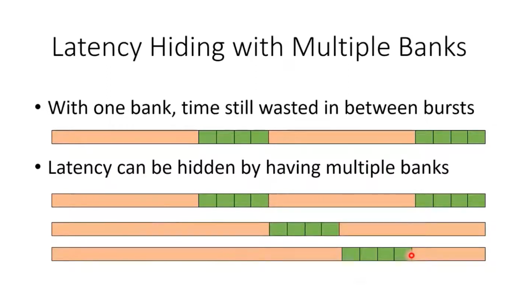

# PMPP 第 1-5 章复习笔记

> 教材：*Programming Massively Parallel Processors: A Hands-on Approach* 第四版（2022, Hwu / Kirk / El Hajj）。
> 用途：学完后遗忘时快速复习。只留机制、公式、有性能含义的数字、API 和会踩的坑。
> 数字以 A100（Ampere, compute capability 8.0）为例。

## Ch1 Introduction

**Crux**：2003 年后单核 CPU 性能因功耗/散热封顶，产业转向并行——为什么 GPU 能在吞吐上碾压 CPU，以及这个红利的代价（Amdahl 定律、内存带宽）。

### 核心概念

- 两条处理器路线：**multicore**（CPU，保持单核顺序速度）vs **many-thread**（GPU，数万线程跑在大量简单 in-order 流水线上）。
- **Latency-oriented design（CPU）**：大 cache、分支预测、乱序执行，降低单线程延迟。
- **Throughput-oriented design（GPU）**：单元小而多，靠海量线程相互掩护隐藏延迟，而不是消除延迟。
- 关键不等式：**降低延迟比提升吞吐贵得多**（延迟减半可能功耗翻两番；吞吐翻倍只需面积/功耗翻倍）——GPU 设计取舍的经济学根源。
- **异构计算**：顺序部分留 CPU，数值密集部分上 GPU；CUDA 就是为 CPU-GPU 联合执行设计的。
- 必记数字（A100）：**9.7 TFLOPS (FP64) / 156 TFLOPS (FP32 tensor core) / 312 TFLOPS (FP16)**；CUDA core 的 FP32 峰值是 19.5 TFLOPS（见 Ch5）。GPU 内存带宽约为同期 CPU 的 **~10 倍**。

### Amdahl's Law（易考易忘）

- 可并行部分占比 p，并行部分加速 S 倍 → 总加速 = `1 / ((1-p) + p/S)`。
  - p=30%，S=∞ → 总加速只有 **1.43×**。
  - p=99%，S=100× → 总加速约 **50×**。
- 结论：要吃到大规模并行红利，**应用必须把 >99% 的时间花在可并行部分**。
- 第二个现实瓶颈：朴素并行化通常直接打满 DRAM 带宽，只能拿到 **~10×** 加速；要用片上内存（shared memory，Ch5/6）减少 DRAM 访问才能继续提。

### 并行编程四大挑战（§1.4，后面每章都在解这些题）

- **算法复杂度**：并行算法可能做更多工作（work efficiency 问题），大数据集上反而更慢；典型武器是 prefix sum/scan（Ch11）。
- **memory bound vs compute bound**：受限于访存带宽 vs 受限于每字节数据的指令数。
- **输入数据敏感性**：数据规模/分布不均 → 线程负载不均（load imbalance）。
- **同步开销**：需要 barrier / atomic 协作时，线程互相等待即开销。

### 与 AI Infra 的关联

- FP16 吞吐（312 TFLOPS）是 FP32 tensor core 的 2 倍——训练/推理偏爱 mixed precision / 低精度（FP16、BF16、FP8）的直接原因。
- Amdahl 定律在训练中的体现：数据加载、通信等串行尾巴限制整体加速——overlap（计算/通信/IO 流水化）是 Megatron、FSDP 等系统的核心工程。
- 单机 CUDA 之外，多卡集合通信（allreduce 等）由 NCCL 提供，是分布式训练的基础设施。

## Ch2 Heterogeneous Data Parallel Computing

**Crux**：CPU（host）和 GPU（device）各有独立内存、各自执行代码，程序必须显式地把数据搬进搬出、把计算以"大量线程"的形式发射到 device 上执行。本章用 vector addition 走通最小程序骨架。

### 数据并行

- **Data parallelism**：对数据集不同部分的计算相互独立，是可扩展性的主要来源——数据越多，可并行的部分越多。
- 写数据并行代码 = 围绕**数据**重新组织计算，让每个独立计算能被并行执行。

### 程序结构与执行流

- 一个源文件混合 host code（CPU 串行）和 device code（kernel）。
- 执行流：host 开始 → 调用 kernel 时 device 上启动一个 **grid**（一次 kernel 调用发射的全部线程）→ grid 完成后回到 host。
- 关键事实：CUDA 线程创建/调度只需很少时钟周期（有硬件支持），CPU 线程要数千个——所以"每元素一个线程"在 GPU 上是合理写法。

### vector addition：三段式 stub

1. **Part 1**：cudaMalloc 分配 device 内存 + cudaMemcpy H→D 拷贝输入
2. **Part 2**：launch kernel
3. **Part 3**：cudaMemcpy D→H 取回结果 + cudaFree

坑：这种"透明外包"模型通常比串行代码**还慢**——拷贝开销大于计算量。真实应用让数据常驻 device、跨多次 kernel 调用摊销开销。

### 必记 API

- `cudaMalloc((void**)&A_d, size)` — 注意与 C `malloc` 不同：**两个参数**（指针的地址 + 字节数），返回值用来报错。
- `cudaFree(A_d)` — 只传指针值。
- `cudaMemcpy(dst, src, size, kind)` — `kind` 为 `cudaMemcpyHostToDevice` / `cudaMemcpyDeviceToHost`；`size` 是**字节数**（`n * sizeof(float)`）。
- **大坑：host 代码不允许解引用 device 指针**；device 指针只能传给 API 和 kernel。
- 错误检查：`cudaError_t err = cudaMalloc(...)`，与 `cudaSuccess` 比较，`cudaGetErrorString(err)` 打日志。

### kernel 与线程组织

- CUDA 是 **SPMD**：所有线程执行同一份 kernel 代码，靠索引区分数据。SPMD ≠ SIMD：各处理单元不必同一时刻执行同一条指令。
- 两层组织：**grid = block 数组**，grid 内所有 block 同样大小；每个 block 最多 **1024** 线程；每维线程数建议为 **32 的倍数**（原因见 Ch4 warp）。
- 三个内置只读变量（各有 `.x/.y/.z`）：`blockDim`（每 block 线程数）、`threadIdx`（线程在 block 内坐标）、`blockIdx`（block 在 grid 内坐标）。
- 全局索引公式（必记）：`i = blockIdx.x * blockDim.x + threadIdx.x`
- kernel 里的循环消失了——**grid 本身就是循环**，一个线程对应原循环的一次迭代。automatic 变量每线程私有。
- 边界保护（必记模式）：block 数向上取整，末尾线程会越界，必须有 `if (i < n)`：

```c
__global__ void vecAddKernel(float* A, float* B, float* C, int n) {
    int i = blockIdx.x * blockDim.x + threadIdx.x;
    if (i < n) C[i] = A[i] + B[i];
}
```

- 函数限定符：
  - `__global__` — kernel：device 执行，host 调用；调用即发射新 grid
  - `__device__` — device function：只能被 kernel / device function 调用
  - `__host__` — host function（默认）
  - `__host__ __device__` 组合：同一份源码编译出 host + device 两个版本

### kernel launch

- 语法：`kernel<<<numBlocks, threadsPerBlock>>>(args)`。
- block 数向上取整：`<<<ceil(n/256.0), 256>>>`（用 `256.0` 强转浮点才能正确取 ceil）。
- 坑/事实：**block 间执行顺序完全任意**，不得做任何假设——这正是同一份代码能在不同规模 GPU 上自动扩展的原因。

### 编译

- NVCC 按关键字拆分 host / device 代码；device 部分先编成虚拟二进制 **PTX**，运行时再编成真实目标代码。

### 与 AI Infra 的关联

- H2D/D2H 拷贝就是 `.to('cuda')`、weight loading、KV cache 迁移的底层动作；PCIe 带宽是经典瓶颈，框架强调数据常驻 device。
- PyTorch 用 **CUDA caching allocator** 缓存显存块，避免反复 cudaMalloc/cudaFree（后者会隐式同步）。
- `blockIdx.x * blockDim.x + threadIdx.x` + `if (i < n)` 是读任何 elementwise kernel（含 Triton 的 `program_id`）都会见到的模式。
- "block 顺序任意"是理解 kernel 并发调度、GPU 程序不能靠执行顺序做同步假设的基础。

## Ch3 Multidimensional Grids and Data

**Crux**：数据天然是多维的（图像 2D、矩阵、体数据 3D），线程靠索引定位自己该处理的元素——本章解决"如何把多维线程组织映射到多维数据"，并给出从 vecAdd 到 matmul 的递进范例。

### Grid/Block 的多维组织

- Grid 是最多 3D 的 block 数组，block 是最多 3D 的 thread 数组；未用的维度设为 1。
- 内置变量：`blockIdx`、`threadIdx`（坐标）、`gridDim`、`blockDim`（launch 时传入的维度）。
- Launch 配置用 `dim3`（构造参数默认 1）：`dim3 dimBlock(16, 16); kernel<<<dimGrid, dimBlock>>>(...)`。
- 必记数字：block 总线程数 ≤ **1024**（如 (8,16,4) 合法，(32,32,2)=2048 非法）；`gridDim.x` ≤ 2³¹−1，`gridDim.y/z` ≤ 65535。

### 线程→多维数据的映射

- 必背映射公式（2D）：

```c
int row = blockIdx.y * blockDim.y + threadIdx.y;
int col = blockIdx.x * blockDim.x + threadIdx.x;
if (col < width && row < height) { ... }   // 边界检查不可省
```

- 线程数按 block 粒度向上取整，必然多出"空转"线程，靠 `if` 挡掉。
- **动态分配的多维数组必须手工线性化**（编译器只替静态数组做 2D→1D 翻译）。
- **Row-major**（C/CUDA 布局）：`idx = row*Width + col`；column-major（FORTRAN）等于转置后的 row-major——调 FORTRAN 系库（老 BLAS）时注意。


### 与 AI Infra 的关联

- matmul 就是 GEMM 的婴儿版：训练/推理绝大多数算力消耗在 GEMM（线性层、attention 的 QK^T/AV）上；"一 block 负责输出一个 tile"是 shared-memory tiling 和 FlashAttention 分块计算的源头思想。
- Row-major 线性化 = PyTorch contiguous tensor 的 stride 语义：`t[row][col]` 即 `data[row*stride[0] + col]`；NCHW/NHWC 布局差异、transpose 后 non-contiguous 的开销都从这里来。
- Blur 的 patch+边界处理是 CNN 卷积层（kernel size、padding）的原型。

## Ch4 Compute architecture and scheduling

**Crux**：GPU 靠什么把几千个线程高效压到一块硅片上——SM/block/warp 三级执行结构 + SIMD 硬件 + 用"超发线程"隐藏延迟（latency hiding），而不是大 cache 和乱序执行。理解 occupancy、warp 调度、control divergence，才能解释 kernel 为什么快或慢。

### 架构与调度

- GPU = 一组 **SM（streaming multiprocessor）**；A100：**108 SMs × 64 CUDA cores = 6912 cores**。
- kernel launch 后，线程**以 block 为单位整体分配到 SM**；同 block 所有线程必须**同时**驻留在**同一** SM（barrier 和 shared memory 的前提）。
- block 需预留硬件资源（thread slots、registers、shared memory、block slots），每 SM 同时驻留的 block 数有限；其余 block 排队等前面的 block **整个执行完**再补位。
- 类比：block 像不可抢占、不可迁移的调度单元，一旦上 SM 就跑到结束。

### 同步与 transparent scalability

- `__syncthreads()`：block 内 barrier。
- **坑：`__syncthreads()` 必须被 block 内所有线程执行到**。if-else 两条路径上各放一个 = 两个不同的 barrier → undefined behavior / deadlock。
- runtime 保证 barrier 不死锁的手段：block 只有在资源**一次性全部到位**时才开始执行。
- 不允许跨 block barrier → block 间任意顺序执行 → **transparent scalability**：同一份代码在小卡上慢、在高端卡上快，无需改代码。这是 CUDA 可扩展性的根基。

### Warp 与 SIMD 硬件

- block 分到 SM 后按 **threadIdx 连续切分为 warp，warp = 32 线程**（实现相关，`devProp.warpSize` 可查）。
- warp 是 SM 的**线程调度单位**。
- block 大小不是 32 的倍数时，最后一个 warp 用 inactive threads 补齐（白占资源）——所以 block 大小取 32 的倍数。
- 多维 block 先按 **row-major 线性化**（x 最快）再切 warp。
- SIMT 硬件：同一 warp 的线程**共享一个 instruction fetch/dispatch unit**，任意时刻整个 warp 执行同一条指令（数据不同）→ 控制硬件成本被 32 路摊薄，更多面积给算术单元。

### Control divergence

- 同一 warp 的线程走不同控制路径 = **control divergence**；硬件为每条路径做一个 pass，不在路径上的线程该 pass 内 inactive，之后 reconverge。代价 = 多 pass + 空占资源。
- **Volta 起**支持 independent thread scheduling，各 pass 可交错执行（之前是串行）。
- 判定方法：**决策条件依赖 threadIdx 就可能 divergence**；边界判断（`if (i < n)`）是最常见来源。
- 影响随数据规模增大而摊薄：1000 元素向量仅 1/32 的 warp 发散，总影响约 3%。
- 坑：不能假设 warp 内线程执行同步。依赖 warp 内"恰好同步"的算法须用 `__syncwarp()` 显式保证。

### Warp 调度与 latency tolerance

- warp 等长延迟操作（global memory 访问等）结果时不被选中，调度器改选其他 ready warp —— **latency hiding**。
- **Zero-overhead scheduling**：所有驻留 warp 的状态（PC、寄存器）常驻硬件寄存器，切换 warp 不需要保存/恢复 → 零开销（对比 CPU 上下文切换要 spill/fill）。
- A100：每 SM 最多 **2048 线程** vs 64 cores → **32 倍超发**，这是延迟容忍的关键。

### 资源划分与 occupancy

- **Occupancy = 实际驻留 SM 的 warp 数 / SM 支持的最大数**。SM 资源在各 block 间**动态划分**。
- A100 硬限制：**每 SM 最多 32 blocks、64 warps (2048 threads)；每 block 最多 1024 线程；每 SM 65,536 registers**。
- 必记推算：
  - block=1024/512/256/128/64 → 均满 occupancy；block=32 → block slots 上限 32 → 只用 1024 线程，50% ⇒ **block 至少 64 线程才能占满**。
  - block=768 → 只能放 2 个（1536 线程）→ 75%。
  - 寄存器：满 occupancy 要求每线程 ≤ 65,536/2048 = **32 registers**；64 regs/thread → 最多 1024 线程 → 50%。
  - **Performance cliff**：31→33 regs/thread 时，512-thread blocks 从 4 blocks/SM 掉到 3 → occupancy 100%→75%。
- 精确计算用 **CUDA Occupancy Calculator**（NVIDIA 电子表格）。

### 查询设备属性（API）

- `cudaGetDeviceCount(&devCount)`、`cudaGetDeviceProperties(&devProp, i)`（填 `cudaDeviceProp`）。
- 常用字段：`maxThreadsPerBlock`、`multiProcessorCount`（SM 数）、`maxThreadsDim[0..2]`、`maxGridSize[0..2]`、`warpSize`。


## Ch5 Memory architecture and data locality

**Crux**：global memory 在片外（DRAM），延迟数百个时钟周期、带宽有限，仅靠大量线程隐藏延迟不够——访存路径会拥塞，导致 SM 空闲。用片上存储（registers/shared memory）+ tiling 减少对 global memory 的访问，把 kernel 从 memory-bound 推向 compute-bound。

###  访存效率为什么重要

- **compute to global memory access ratio**（= arithmetic/computational intensity，FLOP/B）：每从 global memory 读一个字节能做多少浮点运算。
- 朴素 matmul 内层循环：2 次 global 访问 ↔ 2 次 FLOP → **0.25 FLOP/B**。
- 必记数字（A100）：global memory 峰值带宽 **1555 GB/s**；FP32 峰值 **19,500 GFLOPS**（tensor core 156,000）。0.25 FLOP/B × 1555 GB/s = **389 GFLOPS，只有 FP32 峰值的 2%** —— 典型 **memory-bound**。
- 要吃满 FP32 峰值，需要 ratio ≥ 19,500/1555 ≈ **12.5 FLOP/B**（每读一个 4 字节 float 要做约 50 次浮点运算）。
- **Roofline Model**：x 轴 arithmetic intensity，y 轴吞吐；两条线分别为峰值算力和峰值带宽；交点左侧 memory-bound，右侧 compute-bound。贴近带宽线的点只能靠提高 intensity 提速。

###  CUDA memory types

- 层级速记：**registers / shared memory 在片上**（快）；global / constant / **local** 都在片外 DRAM（慢）。注意 **local memory 实际位于 global memory**，只是每线程私有（静态数组、spilled registers、调用栈）。
- registers：算术指令内建寄存器操作数，不需要额外 load；聚合带宽比 global 高至少两个数量级。
- shared memory：架构术语 **scratchpad memory**；block 内所有线程共享，是线程协作的载体。
- GPU 把所有驻留线程的寄存器都留在 register file 里 → warp 切换零开销（对照 CPU 的 save/restore）。
- 声明限定符速查表（Memory / Scope / Lifetime）：

  | 声明 | Memory | Scope | Lifetime |
  |---|---|---|---|
  | 自动标量变量 | register | thread | grid |
  | 自动数组变量 | local | thread | grid |
  | `__shared__ int SharedVar;` | shared | block | grid |
  | `__device__ int GlobalVar;` | global | grid | application |
  | `__constant__ int ConstVar;` | constant | grid | application |

- 易忘的坑：
  - 自动数组不放进寄存器（例外：所有访问都是常量下标）。
  - `__constant__` 必须在函数体外声明；kernel 不能写；上限 **64 KB**；有缓存，访问模式合适时很快。
  - global 变量跨 block 同步没有简便手段（只能靠 atomic 或结束 kernel），常用于 kernel 调用之间传递信息。

###  Tiling 减少访存流量

- 核心 tradeoff：global 大而慢，shared 小而快 → 把数据切成能放进 shared memory 的 **tile**；前提：各 tile 上的计算可相互独立。
- 必记结论：tile 为 T×T 时，global memory 流量减少 **T 倍**（16×16 → 1/16）；计算分为 **Width/TILE_WIDTH 个 phase**，每 phase 全部线程协作装载一对 M/N tile，然后从 shared memory 用多次。
- **locality**：每个 phase 聚焦一小片输入数据，是小而快的存储能服务大部分访存的根本原因（对 CPU cache 和 GPU shared memory 同理）。
- **strip-mining**：把长循环拆成"外层 phase 循环 + 内层短循环"，配合 barrier 强制所有线程在每个 phase 聚焦同一段数据——tiling 的实现手法。

###  Tiled matmul kernel

```cuda
__shared__ float Mds[TILE_WIDTH][TILE_WIDTH];
__shared__ float Nds[TILE_WIDTH][TILE_WIDTH];
int Row = by * TILE_WIDTH + ty, Col = bx * TILE_WIDTH + tx;
for (int ph = 0; ph < Width/TILE_WIDTH; ++ph) {
    Mds[ty][tx] = M[Row*Width + ph*TILE_WIDTH + tx];   // 每线程装 1 个 M 元素
    Nds[ty][tx] = N[(ph*TILE_WIDTH + ty)*Width + Col]; // 每线程装 1 个 N 元素
    __syncthreads();                    // ① 装载完成前不许用
    for (int k = 0; k < TILE_WIDTH; ++k) Pvalue += Mds[ty][k] * Nds[k][tx];
    __syncthreads();                    // ② 用完前不许覆盖
}
P[Row*Width + Col] = Pvalue;
```

- 两个 `__syncthreads()` 对应两种依赖：① **read-after-write**（true dependence）；② **write-after-read**（false dependence，只是复用同一存储位置）。
- 效果：16×16 tile 把 ratio 从 0.25 提到 **4 FLOP/B**，A100 上 389 → **6220 GFLOPS**（峰值的 32%）；更高性能直接上 **cuBLAS / CUTLASS**。
- CPU vs GPU tiling：CPU 靠 cache **隐式**保留复用数据；GPU 一个 SM 跑大量线程争抢 cache 槽位，cache 不可靠，必须用 shared memory **显式**保留。

### Boundary checks

- 矩阵宽度不是 tile 宽度整数倍时，越界 load 会读到线性化布局里下一行的元素（污染结果）或访问数组外内存；且**任何 phase** 都可能越界，不只是最后一个。
- 易忘的坑：不能简单地"排除不算有效 P 的线程"——这些线程还要帮同 block 的别人装载数据。原则：**每次访存都要有对应的边界检查**，装载 M、装载 N、写回 P 用三个不同的测试。
- 三个条件：装 M → `Row < Width && (ph*TILE_WIDTH+tx) < Width`；装 N → `(ph*TILE_WIDTH+ty) < Width && Col < Width`；不满足时往 shared memory 写 **0.0**（对内积无害）；写 P → `Row < Width && Col < Width`。

### 访存用量对 occupancy 的影响

- registers 和 shared memory 用量都会限制 SM 上能驻留的线程数 → 影响延迟隐藏能力。
- 必记数字（A100）：每 SM shared memory 最多 **164 KB**，最多 **2048 线程** → 满 occupancy 要求平均 ≤ **82 B/thread**。tiled matmul 只用 8 B/thread，不受 shared memory 限制。
- 反例：每 block 32 KB shared、256 线程 → 132 B/thread → 最多驻留 1272 线程 → occupancy 只有 **62%**。
- 动态 shared memory：声明 `extern __shared__`（不带尺寸），launch 时把字节数作为**第三个配置参数**传入（`<<<grid, block, size>>>`），kernel 内手动切分区段。


## Performance Considerations


## DRAM特征

### Memory Coalescing

warp内的多个threas访问连续的内存地址，通过合并请求，减少Dram request


#### Hiding memory latency




### Thread Coarsening

**让每个线程负责多个原本由不同线程处理的工作单元，以减少“为了并行而付出的成本”。**


相邻两个输出 tile 会需要同一块 M 输入数据；但 shared memory 不能跨 block 共享，所以两个 block 都得各自从 DRAM 加载一次 M tile，产生重复访存。若硬件资源足够、两个 block 真能并行，这个重复代价可能值得。若硬件最终把这两个 block 串行执行，重复加载就纯属浪费。

此时可令一个 block 计算多个相邻输出 tile，每个线程计算多个输出元素。例如 `COARSE_FACTOR = 4` 时，每线程维护 4 个 `Pvalue` 累加器；M tile 只加载一次，依次加载多个 N tile 来更新这些结果。

它的本质是用更少的线程/blocks，换取更多数据复用，减少：

- 重复全局内存访问；
- 重复工作；
- 同步和control diverge等并行开销。

但不能盲目加大粗化因子：

- 像向量加法这类独立元素计算，本来没有跨 block 的重复成本，粗化通常收益很小。
- 粗化过头会暴露不足的并行度，GPU 可能吃不满。
- 每线程需要更多寄存器（或每 block 更多 shared memory），可能降低 occupancy，反而变慢。
- 最优 `COARSE_FACTOR` 通常依赖具体 GPU 和数据规模，需要调参。

一句话：**当硬件无法真正并行执行所有细粒度任务时，主动让一个线程多做一些，可以用较少的并行度换取更少的冗余工作与访存。**


| Optimization                              | Benefit to compute cores                                     | Benefit to memory                                            | Strategies                                                   |
| ----------------------------------------- | ------------------------------------------------------------ | ------------------------------------------------------------ | ------------------------------------------------------------ |
| Maximizing occupancy                      | More work to hide pipeline latency                           | More parallel memory accesses to hide DRAM latency           | Tuning usage of SM resources such as threads per block, shared memory per block, and registers per thread |
| Enabling coalesced global memory accesses | Fewer pipeline stalls waiting for global memory accesses     | Less global memory traffic and better utilization of bursts/ cache lines | Transfer between global memory and shared memory in a coalesced manner and performing uncoalesced accesses in shared memory (e.g., corner turning) Rearranging the mapping of threads to data Rearranging the layout of the data |
| Minimizing control divergence             | High SIMD efficiency (fewer idle cores during SIMD execution) | -                                                            | Rearranging the mapping of threads to work and/or data Rearranging the layout of the data |
| Tiling of reused data                     | Fewer pipeline stalls waiting for global memory accesses     | Less global memory traffic                                   | Placing data that is reused within a block in shared memory or registers so that it is transferred between global memory and the SM only once |
| Privatization (covered later)             | Fewer pipeline stalls waiting for atomic updates             | Less contention and serialization of atomic updates          | Applying partial updates to a private copy of the data and then updating the universal copy when done |
| Thread coarsening                         | Less redundant work, divergence, or synchronization          | Less redundant global memory traffic                         | Assigning multiple units of parallelism to each thread to reduce the price of parallelism when it is incurred unnecessarily |
