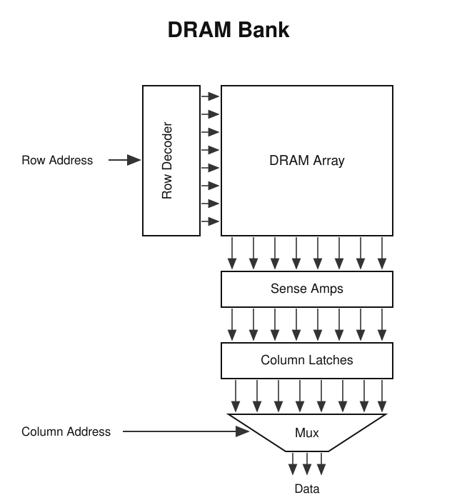

# DRAM：cell、bank 与突发访问

> 动机：DRAM 的物理结构决定了"连续地址快、随机地址慢"，这是 GPU coalescing、CPU cache line 友好访问等一切访存优化的根源。配合 PMPP Ch6 阅读；更深入的内存系统全景见 06 章提到的 Drepper《What Every Programmer Should Know About Memory》。

## DRAM cell：1T1C

存 1 个 bit 的最小单元 = **一个电容 + 一个晶体管**：

```
        word line（行选通，接几千个 cell 的门极）
           │
        ───┴───
       │ 晶体管 │        bit line（列数据，一列共享）
       └───┬───┘   ═══════╪═══════
           │              │
          ═╪═ 电容         │ → sense amplifier（读出放大器）
           │
          GND
```

- **电容**存电荷：有电 = 1，无电 = 0。
- **晶体管**是门：word line 打开它，电容才与 bit line 接通；平时关着隔离保存。

## 读一次的完整时序

1. **预充（precharge）**：bit line 充到中间电平 Vdd/2，建立参考点（对应时序参数 tRP）。
2. **拉起 word line**：row decoder 驱动 word line 到高电平，打开**整行**所有 cell 的晶体管。word line 连着几千个门极，驱动它本身就要时间（对应 tRCD）。
3. **电荷分享**：cell 电容推动共享 bit line，电压偏离 Vdd/2 一点点（几十 mV 量级）。
4. **sense amp 放大**：检测偏离**方向**——高于参考判 1，低于判 0——并把信号放大到满电平。
5. **restore（写回）**：不是额外步骤。放大后的满电平就加在 bit line 上，而晶体管还开着，电容被顺手充回刚读出的值。读是破坏性的，restore 是放大动作的副产品。

关键：每次访问 = 预充 + 激活 + 放大/restore 全部做完，cell 阵列才能服务下一次访问。这个长延迟无法消除，只能靠并行掩盖。

## 为什么慢：1T1C 的共享权衡

- 一个小电容去驱动一根连着几千个 cell 的长 bit line（大电容负载），靠**电荷分享**产生可检测信号——天然弱、慢。
- 不能靠把电容做大提速：DRAM 追求密度，电容一直在往小做，所以 DRAM 访问延迟几十年基本没降。
- 换来的好处：bit line 和 sense amp 整列共享，cell 本身只有 1 晶体管 + 1 电容 → 密度高、便宜。**共享省面积，代价是速度**。

## refresh：Dynamic 的由来

电容漏电，几十毫秒内电荷漏光 → 必须周期性刷新。刷新的实现就是"读一遍"：sense amp 把每个 cell 的值重新放大即完成 restore，数据不用搬去任何地方。

## DRAM bank 内部结构



```
Row Address ──→ ┌─────────────┐
                │ Row Decoder │──→ 选中一行，拉起其 word line
                └─────────────┘
                       ↓
                ┌─────────────┐
                │  DRAM Array │     cell 阵列（行 × 列）
                └─────────────┘
                       ↓ 整行所有 bit line
                ┌─────────────┐
                │  Sense Amps │     放大 + 锁存整行 = row buffer
                └─────────────┘
                       ↓
                ┌─────────────┐
                │Column Latches│    整行数据稳定锁存，供分批送出
                └─────────────┘
                       ↓
                ╱     Mux     ╲   ← Column Address：选出哪组放行
                     ↓
                   Data（窄，如 64 bit）
```

- 矛盾：行很宽（几 K~几十 K bit），对外数据口很窄。
- **Column Latches**：把整行锁存住，之后慢慢挑、分批送（DDR prefetch 也靠它）。
- **Mux**：纯组合逻辑选择，Column Address 决定哪组 bit 上总线。

## burst：连续地址为什么快

- **慢的部分**（预充/激活/放大）每行只付一次，结果摊在整个 row buffer 里。
- **快的部分**：之后只需列地址递增，Mux 切换即可连续吐数据，不碰 cell 阵列，总线全速。
- burst = **行地址不动 + 列地址连续递增**。随机访问每次换行都要重新付全额行激活延迟。

## 三个粒度：row / burst / sector

谈"连续访问快"时必须分清三个粒度，否则概念会打架：

| 粒度 | 典型大小 | 由什么决定 |
|---|---|---|
| **row**（行） | 1~2KB | DRAM 阵列一行的物理宽度；行激活的粒度，激活后存活在 sense amps |
| **burst** | 64B | 总线宽度 × burst length（64-bit × BL8）；一次列命令传输的单位 |
| **cache line** | 64B | 处理器 cache 的填充单位 |
| **sector**（GPU） | 32B | GPU cache 的取数粒度，miss 时只取需要的 sector，防止 over-fetch |

关系：**一行 = 16~32 个 burst，一个 burst 通常 = 一条 cache line，一条 line 在 GPU 上 = 2~4 个 sector**。burst = cache line 不是物理必然，是工程对齐：让"一次 miss 填一条 line"恰好对应"一次列命令发一个 burst"。

## bank / channel：用并行掩盖延迟

- 单 bank 时总线利用率上限 = 1/(R+1)，R = cell 访问延迟 : 数据传输时间（典型 20:1 → 约 4.8%）。
- 解法：一个 channel 挂多个 bank，一个 bank 在访问 cell 时另一个在传数据，交错掩盖延迟；多个 channel 进一步加宽。
- DRAM 的三级并行：**burst（行内）→ bank（片内交错）→ channel（控制器级）**。

## 关键结论：同一个物理事实，CPU 和 GPU 用法不同

burst/line 机制使"取一段"和"取一字节"的代价几乎相等。CPU 和 GPU 都在利用这个事实，但机制不同：

- **CPU —— 时间上的复用（cache 吸收）**：同一个线程先后访问同一条 cache line。第一次 miss 把整 line 填进 cache，后续访问被 cache 拦截，根本不到 DRAM。优化 = 时间/空间局部性，cache 自动受益，程序员"自然而然"就吃到红利。
- **GPU —— 并发上的合并（coalescer 归并）**：一个 warp 的 32 个线程在**同一拍**发出 32 个地址，没有先后——第一个访问自己也是 miss，不存在"先填 cache 再等命中"的机会。所以 GPU 在 cache 上游有 coalescing 硬件，在访存发射时刻把并发请求按 sector 归并：连续 → 128B 合并成一笔交易（一次行激活 + 一次突发服务 32 个线程）；散乱 → 32 次独立行程，多数还要换行付全价。

一句话：**CPU 靠 cache 做时间维的复用，GPU 靠 coalescer 做并发维的合并；cache 解决不了"同时"的问题，所以 GPU 要把访问模式交给程序员操心。**

理解 GPU 访存时最大的思维障碍，是带着 CPU 的 context（顺序访问流、第二次访问被 cache line 吸收）去套 GPU 的模型——GPU 的出发点自始至终是 warp 同一拍的并发访问，从这里出发，coalescing 的一切规则都是自然推论。

对程序员的具体推论：

- **CPU 侧**：顺序访问、结构体字段紧凑布局、避免 false sharing，都是在利用 line/burst 粒度。
- **GPU 侧（PMPP Ch6）**：
  - **coalescing**：让 warp 的 32 个地址落进尽量少的 line/burst 内 → 尽量少的列命令和行激活；判定方法是看数组下标中 `threadIdx.x` 的系数是否为 1。
  - **occupancy 的另一重意义**：不只是隐藏流水线延迟，也是隐藏 DRAM 延迟——要有足够多的并发访存才能喂饱 bank 交错、打满带宽。
- **整条链路的优化地图**：coalescing（DRAM 层）→ cache 复用（cache 层）→ tiling（shared memory 层）——把数据尽可能留在贵的层级的上游。
